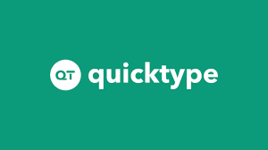
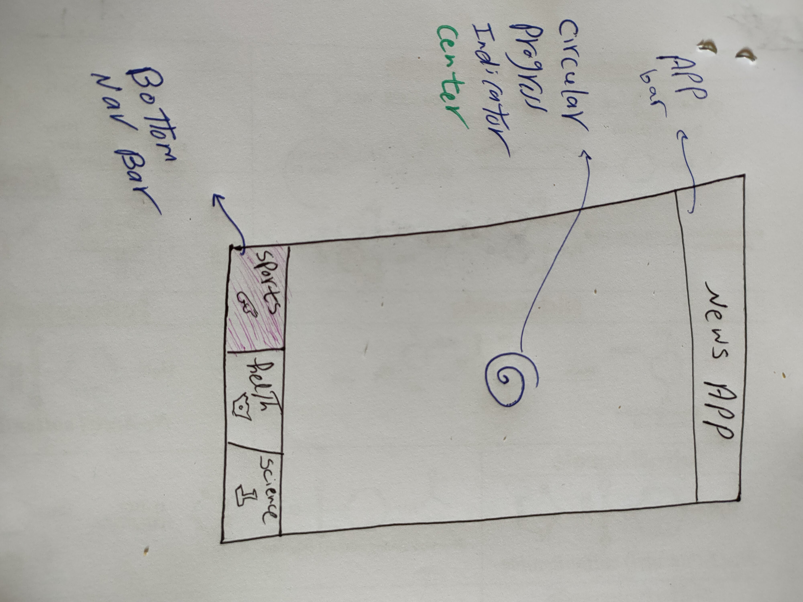
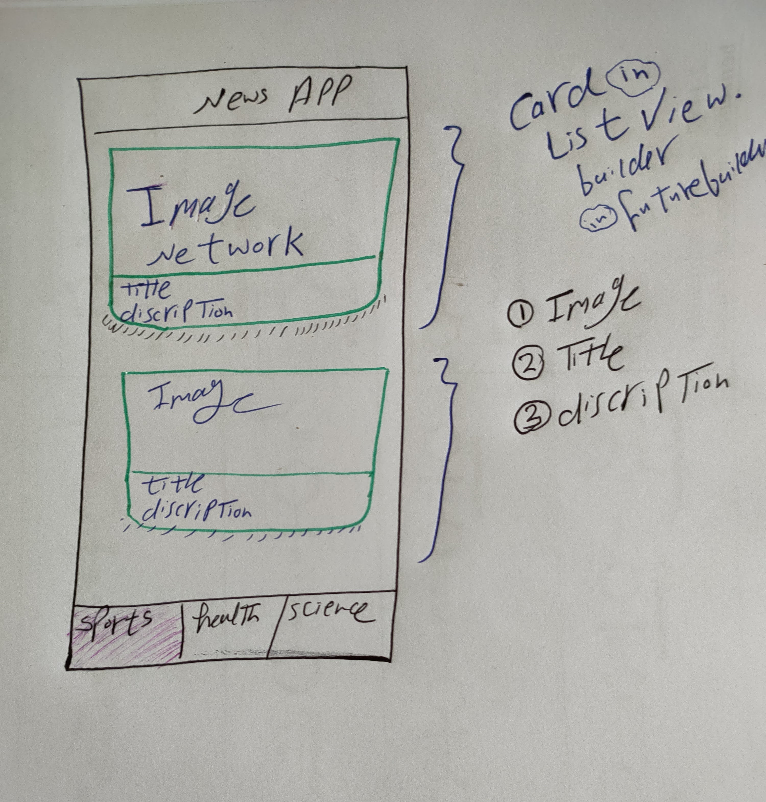
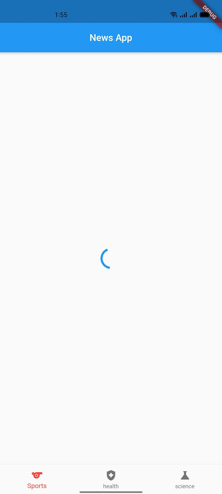
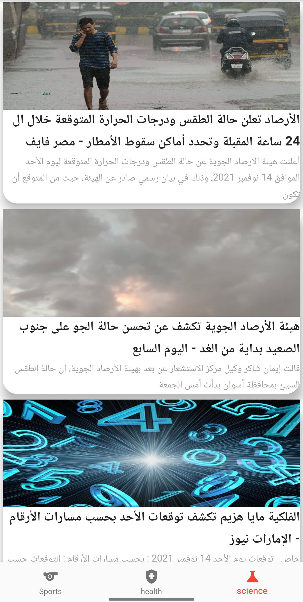
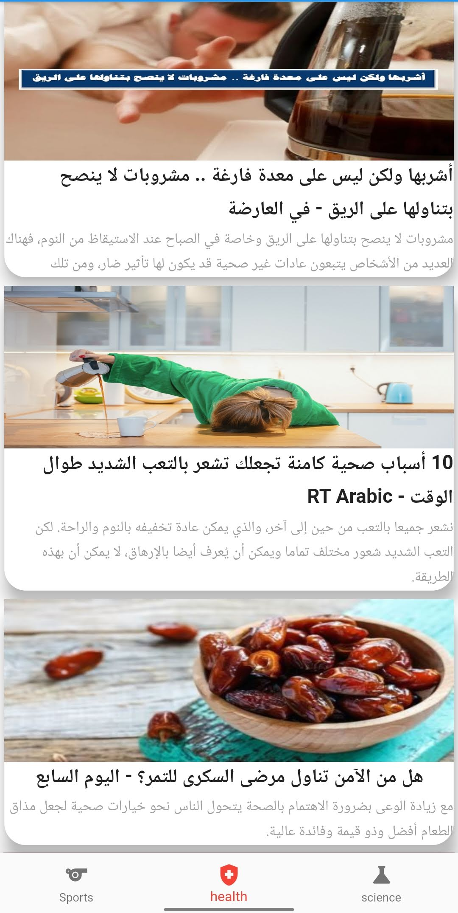
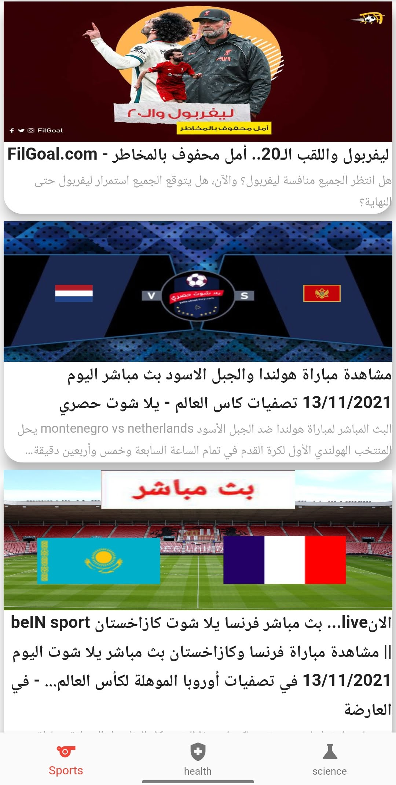

# News App
News App with NewsApi & GetX [MVC pattern]

<b>News App</b>

## About

News App with NewsApi & GetX [MVC pattern]

## Benfit

- [x] [GetX]
- [x] MVC patterns
- [x] Fetch news from API.
- [x] Parse complicated JSON.
- [x] Use http Package
- [x] Display full news with full details.
- [x] Select news category page
- [x] News Home page

## Snapshots

| NewsApi | app.quicktype.io  |
|------|-------|
|||

| page one sketch | pae two sketch |
|------|-------|
|||

| On Reload | Home Page |
|------|-------|
|||

| Health page| Science Page |
|------|-------|
|||

| Sports Page |
|------|
|

## Other Flutter Projects
- [music app player external storage read](https://github.com/itsherifAhmed/Music-Player-Read-external-Storage-Flutter-app)
- [Make Up App flutter MVC Getx](https://github.com/itsherifAhmed/MakeUp-App)
- [Speech to Text app flutter](https://github.com/itsherifAhmed/Speech-to-text-app)
- [api flutter project](https://github.com/itsherifAhmed/apiFlutter-Project)
- [qr code app](https://github.com/itsherifAhmed/qr-barcode)
- [facebook ui clone](https://github.com/itsherifAhmed/facebook-ui-clone)

